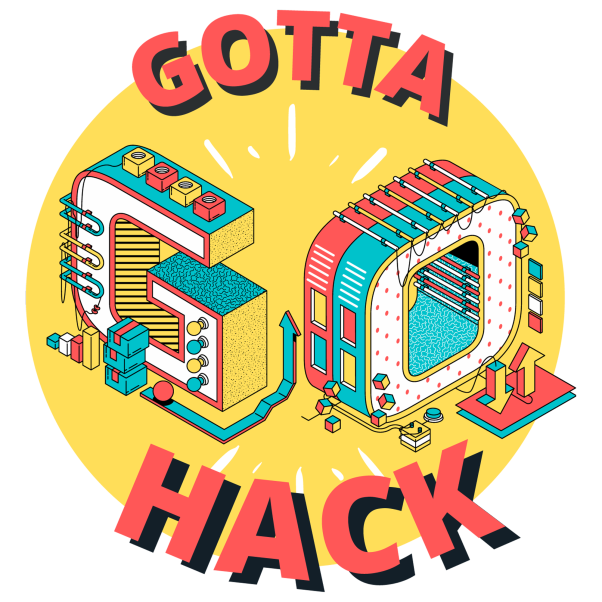

<h1 align="center">
  
</h1>

  

 

- :office: &nbsp;I'm currently working at **EPITA**
- :seedling: &nbsp;I’m currently learning **Machine Learning and Artificial Intelligence**
- :speech_balloon: &nbsp;I like to talk about **Chess** and **Music**
- :mailbox: &nbsp;Ask me anything on my **[issues page]**
- :computer: &nbsp;Connect with me on **[LinkedIn]**
- :apple: &nbsp;Visit my **[website]**

 

<h2 align="center">Languages and Tools</h2>

 

<h2 align="center">Few Links</h2>

<h5 align="center">
  <code></code>
  <code></code>
  <code></code>
</h5>

 

    
    
    
    
    
    
    
    
    
    
    
    
    
    
    
    
    
    
    
    
    
    
    
    

[issues page]: https://github.com/Bictole/Bictole/issues "Bictole/issues"
[linkedin]: https://www.linkedin.com/in/victor-simonin/ "Victor Simonin LinkedIn"
[website]: https://www.victorsimonin.fr "Victor Simonin Website"
[email]: victor.simonin@epita.fr "Victor Simonin email"
